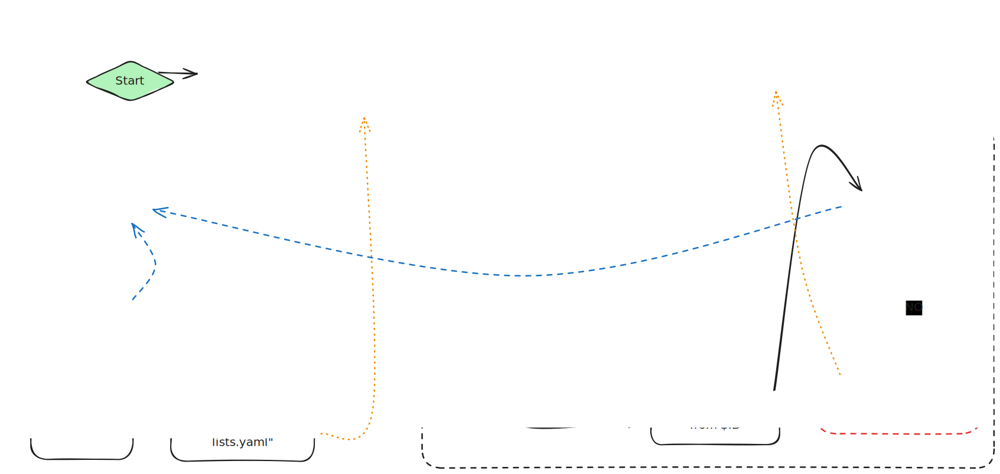

# Mailing Lists Archiver - Track Mailing Lists over NNTP into local files

Collect and archive locally all emails from mailing lists.
This is in active development. It currently supports reading from NNTP endpoints.

This project a few main components:

1. [Archiver](#archiver) : Keep (raw) local copies of emails in from mailing lists
2. [Mailing List Parser](#mailing-list-parser): Parse the raw copies into a Parquet columnar dataset
3. [Anonymizer](#anonymizer): Pseudo-anonymize personal identification from the dataset

# Archiver

## Usage

To compile this program, use the `make build` command. The rust compiler with the `cargo` utility is needed.
If not available, the makefile will use `podman` or `docker` and build the program using the container image for the rust compiler.

The most basic way to run this program, is to provide the NNTP Hostname and port via env variables. `NNTP_HOSTNAME="rcpassos.me" NNTP_PORT=119 cargo run`, or via arguments : `cargo run -H rcpassos.me -p 119` (note: this website is not a NNTP server).
The list of available news groups in the server will be provided for selection.

A config file can be used too (check the Example below).
By default, this program will look for the config file in the current directory.
It will look for nntp_config*.{json,yaml,toml}.

A custom config file path can be passed with the flag `-c`. Ex: `cargo run  -c other_nntp_config.yaml`

```bash
Usage: mailing-lists-archiver [OPTIONS]

Options:
  -c, --config-file <CONFIG_FILE>      [default: nntp_config*]
  -H, --hostname <HOSTNAME>            
  -p, --port <PORT>                    [default: 119]
  -o, --output-dir <OUTPUT_DIR>        [default: ./output]
  -n, --nthreads <NTHREADS>            [default: 1]
      --group-lists <GROUP_LISTS>      
      --article-range <ARTICLE_RANGE>  comma separated values, or dash separated ranges, like low-high
  -h, --help                           Print help
```

The `RUST_LOG=debug` variable can be used to increase logging details.

args: `cargo run -- -c offnntp_config.yaml -H rcpassos.me -p 119`

### Example config file

```yaml
# nntp_config.yaml
hostname: "rcpassos.me"
port: 119
nthreads: 2
output_dir: "./output"
group_lists:
  - dev.rcpassos.me.lists.gfs2
  - dev.rcpassos.me.lists.iommu
```

## Implementation

The archiver is implemented in rust, and uses a NNTP library we forked.
It is designed to be a multi-thread* process that can keep the local files up-to-date with the articles (emails) available in the NNTP server.
It is, however, not designed to pull emails as fast as possible, as it could be seen as a malicious our abusive scraping bot.

> *Each thread is able to check one mail-group (mailing list) at a time from the server.
> A thread will only fetch one email at a time.



# Mailing List Parser

Used to parse the output emails from the Archiver into a columnar parquet dataset

## Usage

Run the `make parse` command.
It requires least `podman/podman-compose` or `docker/docker-compose`.

The parsed emails will be saved in a parquet formatted archive (using hive partitioning on the name of the mailing lists) in the `parser_output/parsed/` directory.

Incorrectly parsed email will be `parser_output/<mailing_list>/errors` directory.

# Anonymizer

To pseudo-anonymize the user identification from emails, run `make anonymize`. It expects the base non-anonymized dataset to be in the default `parser_output/parsed` folder, but this can be changed in the compose.yaml file.

This script will replace user identification by SHA1 digests, and produce a more compressed version of the dataset under the `anonymizer_output` folder.

# Example Analysis

There are example analyses that were used during research in the [./analysis](./analysis) folder.
They can be run with `make analysis`. The output will be stored in [./analysis/results/](./analysis/results/) folder.
